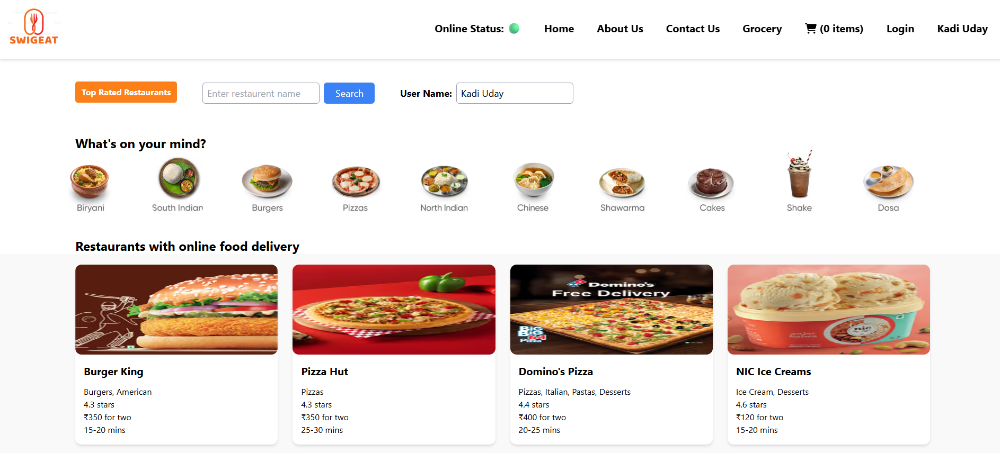
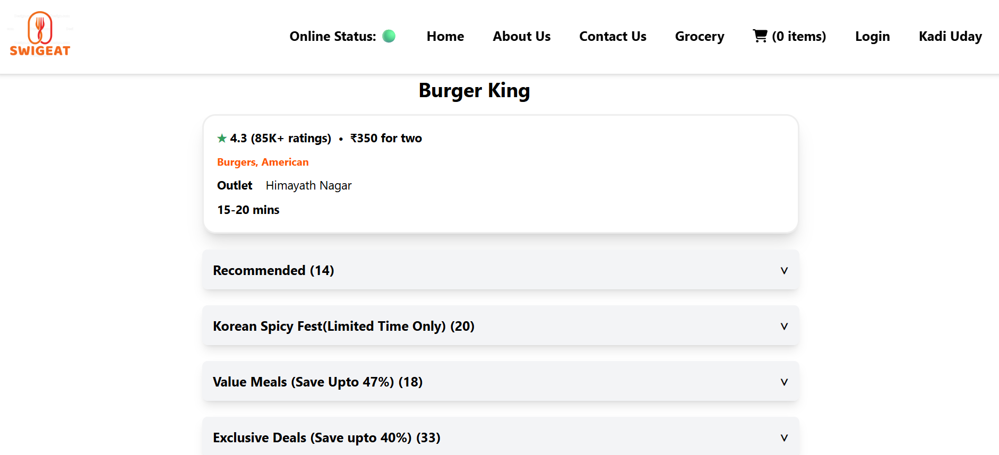
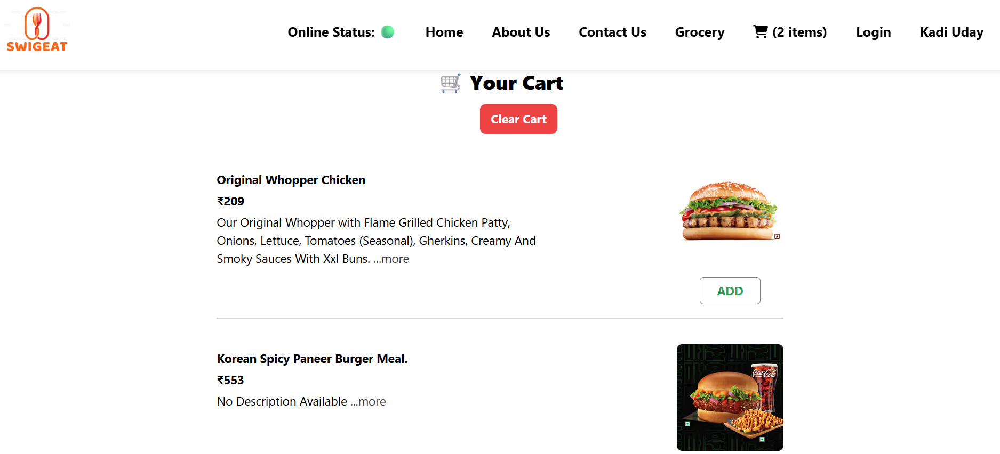

# 🍔 SwigEat - A Swiggy Clone

SwigEat is my first full-fledged React project, inspired by Swiggy. It helped me explore core React concepts, API handling, Redux, Tailwind CSS, and testing. The application allows users to browse restaurants, view menus, and manage a shopping cart.

## 🚀 Features

- **Restaurant Listings** – Browse restaurants fetched from Swiggy's API.
- **Menu Display** – View detailed menus for selected restaurants.
- **Cart Functionality** – Add and Clear Cart items.
- **Real-time API Integration** – Fetches restaurant data dynamically based on locality.
- **Search Functionality** – Search restaurants by name.
- **Shimmer Loading UI** – Loading animation for better UX.
- **Routing** – Seamless navigation between pages with React Router.
- **Testing** – Unit tests and Integration tests are written with Jest & React Testing Library.

## 🛠️ Technologies Used

- **React** – Functional components, hooks (`useState`, `useEffect`)
- **Redux + Redux Toolkit** – For global state management (cart)
- **Tailwind CSS** – For responsive, utility-first styling
- **React Router DOM** – Client-side routing
- **Jest** – Unit Testing and Integration Testing.
- **Swiggy Public API** – Mock or live restaurant data fetching

## 📚 Learnings

- Created a project from scratch with custom file structure.
- Mastered key React hooks and state management principles.
- Integrated Redux with slicing and async reducers.
- Styled modern UI with Tailwind CSS without custom CSS.
- Handled async API calls with loading fallback components.
- Wrote unit tests and integration tests for component-level validation.
- Debugged rendering issues and optimized component re-renders.

## 🔧 Installation

1. Clone the repository:
   git clone https://github.com/kadi-uday/SwigEat.git
   cd SwigEat

2. Install dependencies:
   npm install

3. Start the development server:
   npm start

## 📸 Screenshots

Here are some screenshots from the SwigEat app demonstrating different pages:

- **Home Page**  
  

- **Menu Page**  
  

- **Menu Items Page**  
  

- **Cart Items Page**  
   

  ## 🚀 Live Demo

  Check out the live SwigEat app here:  
  👉 [SwigEat on Netlify](https://swigeat-clone.netlify.app/)

## 🤝 Contributing

Pull requests are welcome! If you have suggestions or improvements, feel free to fork and submit a PR.
